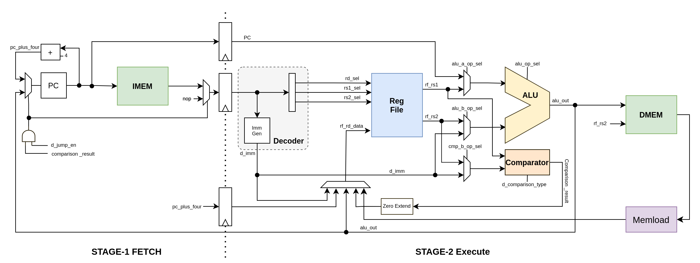

# riscv-atom

Atom is a 32-bit embedded-class processor based on the [RISC-V](https://riscv.org/) Instruction Set Architecture (ISA). It is designed to be light on hardware resources and still powerful enough to be deployed in most embedded class applications.

Key highlights of Atom are listed below:

- Implements RV32I + M(optional) ISA as defined in the [RISC-V unprivileged ISA manual](https://github.com/riscv/riscv-isa-manual/releases/download/Ratified-IMAFDQC/riscv-spec-20191213.pdf).

- Simple 2-stage pipelined architecture, ideal for smaller FPGAs.

- Wishbone ready CPU interface.

- Interactive RTL simulator [AtomSim](AtomSim).

- Wide range of example programs.

- Open source under [MIT License](https://en.wikipedia.org/wiki/MIT_License).

[](https://lbesson.mit-license.org/)

## Table of Contents

1. [Atom Architecture](Atom-Architecture)
2. [Targets](Targets)
3. [Prerequisites](Prerequisites)
4. [Build Instructions](Build-Instructions)
5. [AtomSim](AtomSim)
6. [License](License)

## Atom Architecture

Atom is an embedded class processor written in verilog. It implements open-source RISC-V instruction set architecture RV32I+M(optional). Atom contains a two stage pipeline inspired from arm cortex m0+. 

Atom has 2 ports, Instruction port & Data port. Both of these ports use a simple handshaking protocol for data exchange. This handshaking protocol can be easily converted to wishbone standard protocol, hence "*Wishbone Ready*".



### Pipeline Stages

- **Stage-1** : In this stage, an instruction is fetched from instruction memory and program counter is incremented by 4.
- **Stage-2** : In this stage, the instruction is decoded, all the signal are assigned in order to execute the instruction. & registers are fetched. A 32 bit immediate is generated by the ImmGen unit. ALU then execute the instruction which is followed by write-back into the register file. Branch calculation also happens in this stage and if branch is taken, the pipeline is flushed. Comparator module in this stage is used for all the instructions that involve comparison like `slt`, `slti`, `beq`, `bltu` etc.

## Targets

### AtomBones

Bare-bone system that consists of only the atom core. It uses C++ simulated instruction memory, data memory, counter and a serial communication module. This is the most basic system of all, and is mostly used for testing and debugging software.

**Memory Map**

| Address                 | Size   | Description   |
| ----------------------- | ------ | ------------- |
| 0x00000000 - 0x03FFFFFF | 64 MB  | ROM (64 MB)   |
| 0x04000000 - 0x07FFFFFF | 64 MB  | RAM (64 MB)   |
| 0x08000000              | 1 Byte | Serial_RX     |
| 0x08000001              | 1 Byte | Serial_TX     |
| 0x08000002              | 1 Byte | Serial_Status |

**Total simulated memory :** 128MB (Code & Data) + 3 Bytes (Serial)

### Hydrogen SoC

It is a basic SoC which contains atom core interfaced to instruction memory, data memory and a UART module via wishbone interconnects.


**Memory Map**

| Address                  | Description |
|:------------------------:|:-----------:|
| 0x00000000 - 0x00000FFFF | ROM (16 KB) |
| 0x00010000 - 0x000013FFF | RAM (8 KB)  |
| 0x00014000               | UART_RX     |
| 0x00014001               | UART_TX     |
| 0x00014002               | UART_SREG   |

## Prerequisites

Run apt update

```bash
$ sudo apt update
```

Install git, make, gcc & other tools

```bash
$ sudo apt-get install git build-essential
```

Install [Verilator](https://www.veripool.org/verilator/)

```bash
$ sudo apt install verilator
```

Install [GTK Wave](http://gtkwave.sourceforge.net/)

```bash
$ sudo apt-get install gtkwave
```

**Note :** The following packages are optional and are only required for generating documentation using doxygen

Install [Doxygen](https://www.doxygen.nl/index.html)

```bash
$ sudo apt install doxygen
```

Install texlive packages (Only needed for [pdf generation](Getting-Started))

```bash
$ sudo apt-get -y install texlive-latex-recommended texlive-pictures texlive-latex-extra
```

## Build Instructions

Get [RISC-V tools](https://github.com/riscv/riscv-tools) & [RISC-V GNU Toolchain](https://github.com/riscv/riscv-gnu-toolchain.git) . Make sure that your `RISCV` environment variable points to your RISC-V installation (see the RISC-V tools and related projects for further information).

### Clone the repository

```bash
$ git clone https://github.com/saurabhsingh99100/riscv-atom.git
$ cd riscv-atom
```

### Building the Simulator

Let's build AtomSim simulator for atombones.

```bash
$ make sim Target=atombones
```

This will create a build/bin directory inside the parent directory. The simulation executable will be available here.

```bash
$ cd build/bin
$ ./atomsim ../example/hello/hello.elf
```

**Adding to Path**

For convenience, `build/bin` directory can be added to path by adding the following line to your `.bashrc` file. This will allow you to invoke atomsim from anywhere.

```bash
export PATH=<your_path>:$PATH
```

just replace `your_path` with the path to the `riscv-atom/build/bin` directory on your machine.

### Running example programs

Example programs reside in the `sw/examples` directory. Each folderr inside this directory contains an example  C/Assembly program and a shell script to compile it.

Let's try the banner program, Go to the banner directory

```bash
$ cd sw/examples/banner/
```

Compile the C file using provided shell script.

```bash
$ ./compile
```

Now run the generated elf file using atomsim

```bash
$ atomsim banner.elf
```

### Generating atomsim code documentation using doxygen

Run make from the parent directory

```bash
$ make docs
```

This will generate *latex* and *html* documentation in their respective folders under the doc directory.

To generate *pdf* file from the latex files:

```bash
$ make pdf-docs
```

**Generating "Documentation & User Manual" pdf** **[TODO]**

```bash
$ make <unknown>
```

## AtomSim

AtomSim is an interactive RTL simulator. It provides an interface which is similar to the [RISC-V Spike simulator](https://github.com/riscv/riscv-isa-sim), but simulates the actual RTL in the backend.

To view available command line options, use

```bash
$ atomsim --help
```

### Modes of Operation

Atomsim supports two modes of simulation: 

1. debug/interactive, 
2. test

#### 1. Debug/Interactive Mode

In this mode of simulation, Contents of Program counter (in both stages), Instruction register, instruction disassembly and contents of registers (if verbosity is set) are printed to stdout. A console with symbol `:` is also displayed at the bottom if screen for user to enter various commands to control the simulation. To step through one clock cycle, user can simply press `enter` key (without entering anything in console).

To invoke interactive debug mode, invoke atomsim with `-d` & `-v`flag:

```
$ ./build/bin/atomsim hello.elf -d -v
Segments found : 2
Loading Segment 0 @ 0x00000000 --- done
Loading Segment 1 @ 0x00010000 --- done
Entry point : 0x00000000
Initialization complete!
: 
-< 1 >--------------------------------------------
F-STAGE  |  pc : 0x00000034  (+4) () 
E-STAGE  V  pc : 0x00000000   ir : 0x00010517   [addi x1, 0x33f]
---------------------------------------------------
 x0  (zero) : 0x00000000   x16 (a6)   : 0x00000000  
 x1  (ra)   : 0x00000000   x17 (a7)   : 0x00000000  
 x2  (sp)   : 0x00000000   x18 (s2)   : 0x00000000  
 x3  (gp)   : 0x00000000   x19 (s3)   : 0x00000000  
 x4  (tp)   : 0x00000000   x20 (s4)   : 0x00000000  
 x5  (t0)   : 0x00000000   x21 (s5)   : 0x00000000  
 x6  (t1)   : 0x00033000   x22 (s6)   : 0x00000400  
 x7  (t2)   : 0x00000000   x23 (s7)   : 0x00000000  
 x8  (s0/fp): 0x00000000   x24 (s8)   : 0x00000000  
 x9  (s1)   : 0x00000000   x25 (s9)   : 0x00000000  
 x10 (a0)   : 0x00000000   x26 (s10)  : 0x00000000  
 x11 (a1)   : 0x00000000   x27 (s11)  : 0x00000000  
 x12 (a2)   : 0x00000000   x28 (t3)   : 0x00000000  
 x13 (a3)   : 0x00000000   x29 (t4)   : 0x00000000  
 x14 (a4)   : 0x00000000   x30 (t5)   : 0x00000000  
 x15 (a5)   : 0x00000000   x31 (t6)   : 0x00000000  
: 
```

##### Interacting With Debug Console

###### Displaying contents of a register

Contents of register can be displayed simply typing its name (abi names are also supported) on the console. ex:

```
: x0
x0 = 0x000045cf
: ra
ra = 0x0000301e
```

use ':' to display a range of registers. ex:

```
: x0 : x1
```

###### Displaying Contents of a memory location

`: m <address> <sizetag>`

address can be specified in hex or decimal.

use *sizetag* to specify the size of data to be fetched, `b` for byte, `h` for half-word and `w` for word (default is word).

```
: m 0x30 b
mem[0x30] = 01
```

use ':' to display contents of memory in a range. ex:

```
: m 0x32:0x38 w
mem[0x30] = 01 30 cf 21
mem[0x38] = 11 70 ab cf
```

###### Generating VCD traces

Tracing can be enabled by:

```
: trace out.vcd
Trace enabled : "./out.vcd" opened for output.
```

or by passing `--trace <file>` option while invoking atomsim.

Tracing can be disabled by:

```
: notrace
Trace disabled
```

###### Controlling execution

You can advance by one instruction by pressing the ***enter-key***. You can also execute until a desired equality is reached:

- until value of a register \<reg> becomes \<value>
  
  ```
  : until <reg> <value>
  ```

- until value of a memory address \<address> becomes \<value>
  
  ```
  : until <address> <value>
  ```

- while \<condition> is true
  
  ```
  : while <condition>
  ```

- Execute for specified number of ticks
  
  ```
  : for <ticks>
  ```

- You can continue execution indefinitely by:
  
  ```
  : r
  ```

- To end the simulation from the debug prompt:
  
  ```
  : q
  ```
  
  or 
  
  ```
  : quit
  ```

> At any point during execution (even without -d), you can enter the interactive debug mode with `ctrl+c`.

###### Miscellaneous

`verbose-on` & `verbose off` commands can be used to turn on /off verbosity.

#### 2. Test Mode

In this mode of simulation, no debug information is printed. Only serial data recieved from the system is printed.

```
$ ./build/bin/atomsim sw/examples/hello/hello.elf
Input File:sw/examples/hello/hello.elf
Entry point : 0x00000000
Initialization complete!
_________________________________________________________________
Hello RISC-V!
Exiting @ tick 511 due to ebreak
```

```
$ ./build/bin/atomsim sw/examples/banner/banner.elf 
Input File:sw/examples/banner/banner.elf
Entry point : 0x00000000
Initialization complete!
_________________________________________________________________

                  .';,.           ....;;;.  
                 .ll,:o,                ':c,. 
                 .dd;co'                  .cl,  
                .:o:;,.                     'o:  
                co.                          .oc  
               ,o'          .coddoc.          'd,  
               lc         .lXMMMMMMXl.         ll  
              .o:         ;KMMMMMMMMK,         :o. 
              .o:         'OMMMMMMMMO.         :o. 
               co.         .o0XNNX0o.         .oc  
               .o:           ..''..           :o.  
                'o:                          :o'  
                 .lc.                      .ll.  
                   ,lc'                  'cl,   
                     'cc:,..        ..,:c:'   
                        .;::::;;;;::::;.    
                              ....        
     ____  _________ _______    __         __                 
    / __ \/  _/ ___// ____/ |  / /  ____ _/ /_____  ____ ___  
   / /_/ // / \__ \/ /    | | / /  / __ `/ __/ __ \/ __ `__ \ 
  / _, _// / ___/ / /___  | |/ /  / /_/ / /_/ /_/ / / / / / /      
 /_/ |_/___//____/\____/  |___/   \__,_/\__/\____/_/ /_/ /_/  
/=========By: Saurabh Singh (saurabh.s99100@gmail.com)====/

UART tx at : 0x00014001
UART rx at : 0x00014000
Exiting @ tick 42362 due to ebreak
```

## License

Atom is open-source under the MIT license! 

Click [here](LICENSE) to know more.
