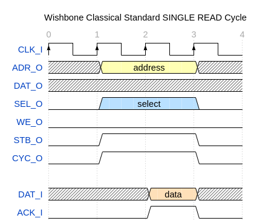
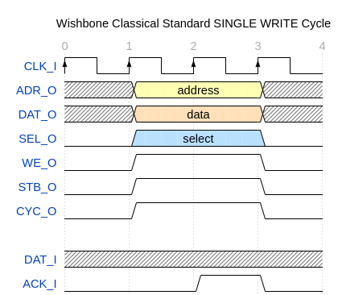

***********
RISCV-Atom
***********
Atom is an open-source 32-bit soft-core processor written in Verilog. It is an embedded class 
processor architecture that implements the open-source RISC-V instruction set architecture (RV32I), 
as describes in the `RISC-V unprivileged spec <https://github.com/riscv/riscv-isa-manual/releases/download/Ratified-IMAFDQC/riscv-spec-20191213.pdf>`_. 
Atom contains a two stage pipeline inspired from arm cortex m0+.

The core architecture of the processor is specified in the file : `rtl/core/AtomRV.v`

Processor Interface
====================
RISCV-Atom has two independent ports which it uses to access memory.

1. Instruction port &
2. Data port

Both the ports use a `Wishbone B-4 <https://cdn.opencores.org/downloads/wbspec_b4.pdf>`_ protocol to 
transfer data. This is a handshaking protocol which uses two signals, "stb" & "ack" signals to 
perform the handshake. The master initiates the transaction, by setting the "stb" signal. This is 
detected by the attached slave after some time or some cycles later. Slave responds by setting its 
"`acknowledge`" signal after performing the corresponding read/write action. Whenever both the 
signals are true, the transaction takes place. 

Processor Pipeline Stages
==========================
Stage-1: Fetch
---------------
Fetch unit is responsible for fetching instructions from instruction memory through the IBUS. It 
uses a 32-bit register called "Program counter" to keep track of the address of the instruction 
being fetched. After the instruction is successfully fetched, Program counter is incremented by 4.

Stage-2: Decode, Execute & Write-back
-------------------------------------
Stage-2 : In this stage, the instruction is decoded, all the signal are assigned in order to configure 
data-path to execute the instruction. & registers are fetched. A 32 bit immediate is generated by the 
ImmGen unit. ALU then execute the instruction which is followed by write-back into the register file. 
Branch calculation also happens in this stage and if branch is taken, the pipeline is flushed. 
Comparator module in this stage is used for all the instructions that involve comparison like 
`slt`, `slti`, `beq`, `bltu` etc.

.. image:: ../../diagrams/atomRV_architecture_diagram.png
  
Pipeline Hazards
=================
1. Structural Hazards: They never occur in Atom since it has a harvard architecture.
2. Data Hazards: Since register read, execute & write-back steps are performed in stage 2 of the 
   pipeline, Data hazards do not occur in Atom.
3. Control Hazards: These occur in Atom whenever a `jump` or `branch` instruction gets executed. 
   In those cases, pipeline is flushed, and the cpu starts fetching instructions from the new address.
