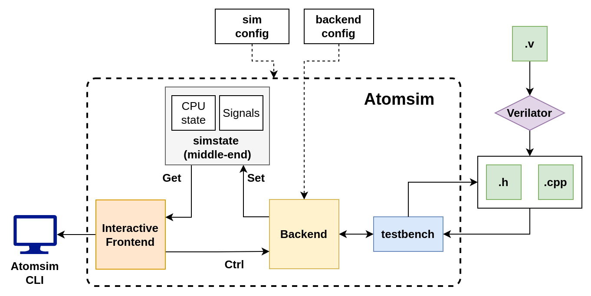

AtomSim: A simulation tool for Atom based SoCs
###############################################

AtomSim is an interactive RTL simulator for Atom based SoCs. It provides an interface which is similar to the RISC-V 
Spike simulator, but simulates the actual RTL in the backend. AtomSim is a feature rich tool which makes it very powerful
for debugging code on the Atom CPU.

Key Features of AtomSim are listed below:

#. Achieves a high simulation rate due to use of Verilator.
#. Target Configurable, can be easily extended for new SoC designs.
#. In-built debug mode similar to spike.
#. External Debug Support using OpenOCD & GDB **[TODO]**.
#. Supports VCD trace generation.
#. Supports memory dumps.
#. Compatible with RISC-V compliance tests framework.
#. Compatible with SCAR framework.

.. tip::
  See :doc:`../../getting_started/building` for info on how to build AtomSim.

The following figure depicts the architecture of AtomSim.

AtomSim Architecture
*********************
AtomSim is designed in a modular fashion with a clear API between the layers. There are 3 main layers in AtomSim,
1) frontend, 2) middle-end, and 3) backend.

Frontend
=========
Frontend is the interactive part of the simulator. User can interact with AtomSim in the following two modes of operation.

#. :ref:`Normal Mode <atomsim_normal_mode>`
#. :ref:`Debug Mode <atomsim_debug_mode>`

Middle-end
===========
Middle-end contains references to signals and states of the CPU. These states and signal values are set by the backend
and read by the frontend to display information.

Backend
========
Backend is the part which probes the signal values and CPU state from the RTL. All backends extend from the ``Backend``
class.

To view available command line options, use:

.. code-block:: bash

  $ atomsim --help

AtomSim Topics
***************
.. toctree::
   :maxdepth: 1

   cli_args.rst
   atomsim_modes.rst
   code_structure.rst
   adding_target.rst
