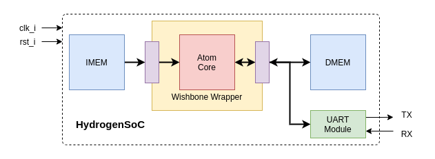

RISC-V Atom SoC Targets
########################
SoC Targets are systems that use the RISC-V atom core alongside different peripherals. From a 
complexity and functionality point-of-view, SoC Targets can be as simple as a wrapper to the core 
interface (e.g. AtomBones) and as complex as multi-core fully-fledged SOCs.

.. _soctarget-atombones:

AtomBones
**********

.. image:: ../../../diagrams/AtomBones.png

.. _soctarget-hydrogensoc:

HydrogenSoC
************

