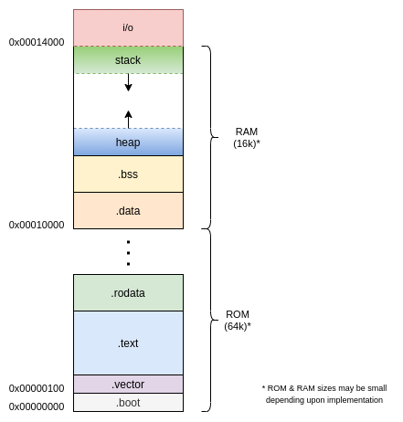

# RISCV-Atom Libraries & Routines

This directory contains libraries which are used to build software on the atom platform.

## Files

```
startup.s		: contains startup code & IVT
link.ld			: linker script
atomrvsoc.h		: memory map related definitions
stdio.h			: standard input-output library
math.h			: math library
```


## Memory Map




## Startup Routine

When the processor is powered on (or reset), it jumps to address `0x00000000`. At this address, the startup routine resides. Startup routine does the following tasks:

1. Initialises stack pointer `sp` & global pointer `gp`.
2. jumps to main label (which may be implemented in c or assembly).


## Interrupt Vector Table

[Todo]

