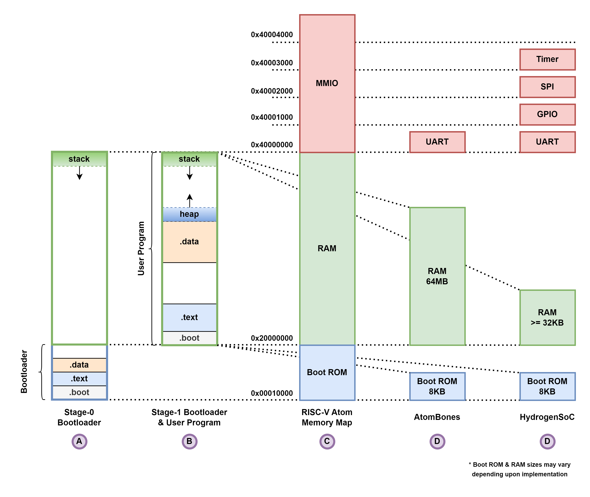

# RISCV-Atom Libc

This directory contains libc implementation for RISC-V Atom based systems, which is called `libcatom`.

## Directory Structure

```
lib
 |--- include  : contains all the libcatom & other headers
 |--- libcatom : contains source files for libcatom
 |--- link     : contains linker scripts for various atom based targets
```

## Memory Map

[To be updated]




## Startup Routine

When the processor is powered on (or reset), it jumps to address `0x00000000`. At this address, the startup routine resides. Startup routine does the following tasks:

1. Initialises stack pointer `sp` & global pointer `gp`.
2. jumps to main label (which may be implemented in c or assembly).


## Interrupt Vector Table

[Todo]

